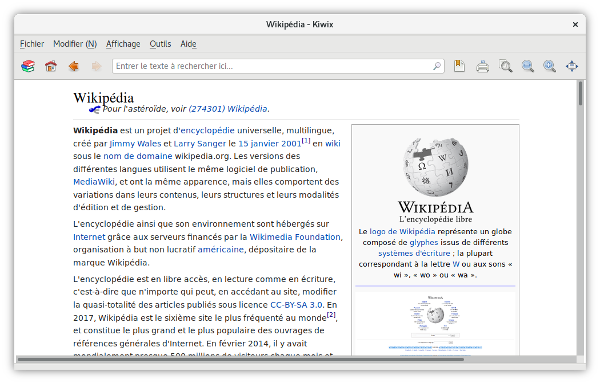
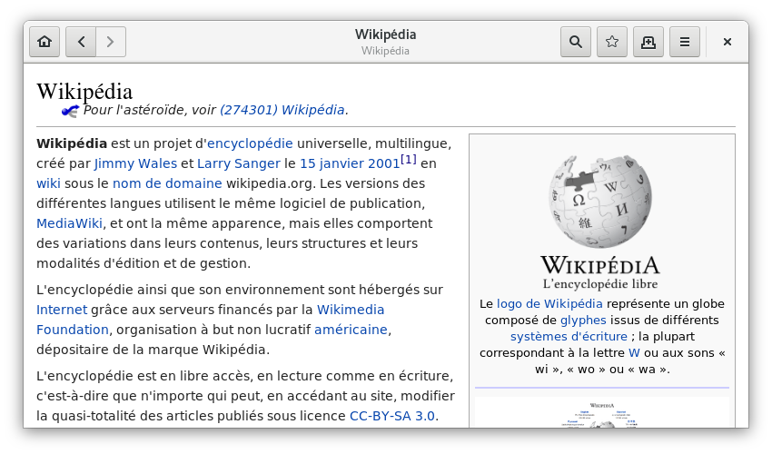

The [web] gives us easy access to knowledge. However, this progress is
accompanied by __perverse effects__. As many __intermediaries__ separate us
from knowledge, we sacrifice some of our __fundamental rights__ in exchange
for comfort. It is therefore important to protect oneself against the
__risks__ raised.

<!-- Summary links -->

[web]: https://en.wikipedia.org/wiki/World_Wide_Web

<!-- more -->

First of all, it is necessary to differentiate [information] from the
[information medium], each medium having its own qualities and disadvantages,
the two main ones being :

- __[Paper medium]__ :
  - __Pro__ : requires no tool to access its content
  - __Con__ : large storage space
- __[Digital medium]__ :
  - __Pro__ : fits in a smaller volume than the paper version
  - __Con__ : depends on a tool to view its content

The existence of a third medium reconciling the best of these two worlds seems
hardly conceivable, it is therefore necessary to make a choise according to
circumstances while keeping in mind that __the paper medium remains the
preferred choice for unrestricted access to knowledge__.

This article focuses solely on the issues raised by access to [free content],
such as that provided by [Wikipedia], through a [computer].

## Escaping the intrinsic weaknesses of the Internet

__Wikipedia__, like all other Internet [services], has at least __two
conceptual weaknesses__ :

1. __Accessibility__ : an Internet connection is required to access the
content, and Wikipedia may be blocked by government order.
2. __Confidentiality__ : the user has no formal guarantee on the anonymization
of its use of the content both on the network and on the Wikipedia server.

To solve these two problems, the idea is to __remove intermediaries__, by
placing content and a reading system directly on the device.

## Kiwix and its web archive format

*Wikipedia page, contained in the Wikipedia archive, displayed in Kiwix*

After this awerness my first reflex was to find out if __a solution already
existed__. Bingo ! __[Kiwix]__ and its __[ZIM]__ web archive format
immediately met my requirements. Even if the reasons that led to their
development are of a completely different nature, they provide a technical
solution to the above-mentioned problem.

Also, it is a [free software] and an [open format], which guarantees
[confidentiality] and __durability__ of the data used.

## Why WebArchives exists

Knowing this __why develop WebArchives ?__

When I was thinking about this problem, the desktop version __Kiwix was
dying__, one of its dependencies no longer being maintained.

Because I'am a daily user of the [GNOME] desktop environment, I came up with
the idea of implementing __ZIM__ file format support within the application
dedicated to consulting digital documents : [GNOME Documents].

But very quickly this idea seemed limited to me :

1. __ZIM format__ : being __not recognized natively__ by most [GNU/Linux]
distributions, listing the archives on the hard disk became complicated
2. __Internal server__ : in order to display the content of an archive,
including embedded videos, its implementation became __a necessity__
3. __Downloadable content__ : since no mechanism for discovering new content
was proposed, its creation was __difficult to include__ within the application

Hence the birth of the WebArchives application.

## WebArchives development

Still to avoid reinventing the wheel, I decided very early on to use the
[software library] developed by the __Kiwix__ team, allowing the use of
__ZIM__ files.

Since [libzim] is developed in [C++], my choice of programming language turned
to this one. Unfortunately I was forced to juggle between libraries coded in
__C++__ and others in [C].

The result giving a code that is difficult to read and therefore maintainable,
I made the decision to build a [binding] of this library thanks to the
[introspection] capacity of the [GObject] library of the GNOME environment.

As __GNOME__ uses [GTK+] graphics library, the choice of the [Vala]
programming language seemed relevant, because this one offers an
[object-oriented paradigm] and is a [compiled language].

Graphically a mix of design rules from both __GNOME__ and [Android] have
guided me in designing the interface, which should be as simple as possible.

## The future of WebArchives

*Wikipedia page, contained in the Wikipedia archive, displayed in WebArchives*

Ideally __WebArchives should not exist__, as web archives are documents almost
like other documents, they should be supported natively by GNOME Documents.
This is the __very long-term vision__ of this project, its death. No need to
create one application per file format.

In the meantime I plan to make internal improvements, invisible to the user,
in order to __make the experience more fluid__. It is basically a question of
making the code asynchronous by using [threads].

Graphically the application is far from my ideal. Wanting to make it usable on
both large and small screens, as well as compatible with touch controls, I'm
waiting to see the result of the __GNOME__ and [Purism] partnership about the
[Librem 5] smartphone running on __GNU/Linux__.

Not wanting to bother with package systems to distribute the application, I
chose to publish it only through the [Flatpak] system and the [Flathub]
repository. In the future, its presence in [Debian] repositories is possible
since its dependencies are almost all present in its repositories.

Today, WebArchives is based on the __ZIM__ file format, which is for my
opinion the best performing one. However, once the application has reached a
certain maturity, it is not excluded to support other file formats, such as
[WARC] paired with __CDX__.

Other __functionalities__ are possible in the __long term__:

- __Table of contents of the page displayed__
- __Navigation between archives__ : to be able to open an external link of an
archive directly in the archive corresponding to the domain name
- __Manage a query from another application__ : for example from GNOME Maps to
Wikipedia, to redirect to the corresponding archive.
- and many others...

## Beyond WebArchives

During the development of WebArchives I noticed the __absence of a number of
software components__ to make life easier for both users and developers. These
topics will be developed in future articles :

- The existence of a kind of __GNOME Market__, looking like [GNOME Software]
but to manage the downloading and updating of content such as maps,
encyclopedias, application manuals, courses, tutorials, dictionaries...
- Too much rigidity in interface design, it is necessary to make the
__interfaces more "*organic*"__. As well as the absence of essential
components within [GLib] or __GTK+__, such as [ORM] or __VirtualListBox__.
- Rethinking the way user data is managed : __a meta file system__ oriented
synchronization, backup and confidentiality
- Establish __more [crowdsourcing]__ : know-how, construction, company, school
content...

## Conclusion

*WebArchives homepage*

In the end, this application is especially useful to me when my Internet
connection is down. In addition, I have less apprehension to search for
information concerning sensitive subjects because I am certain that I am not
being spy, whereas on the Wikipedia website I censor myself for fear of being
monitored.

Some will say that this tool has __no interest__ today, because Internet
access has never been so simple. They're not entirely wrong, but you have to
think of this tool as a __fire extinguisher__, you don't need it in your
everyday life, but you may one day need it. Nothing tells us that tomorrow's
world will be free, __better safe than sorry__.

__Another advantage__, with such tool is very easy to share knowledge.
__Copying a digital file will always be easier and faster than copying a paper
book__.

Not wanting to go into too much detail, this article doesn't talk about all
that I learned by making this app, focusing essentially on why it exists. The
main purpose of this text is therefore to summarize the main stages of this
project.

## Useful links

- [WebArchives project presentation sheet]
- [WebArchives sources]
- [Link to Flathub applications including WebArchives]
- [Kiwix website]
- [Debian Website]
- [Flatpak website]
- [Flathub website]
- [GNOME website]
- [GObject introspection]

<!--External links and references-->

[Paper medium]: https://en.wikipedia.org/wiki/Book
[Digital medium]: https://en.wikipedia.org/wiki/E-book
[information]: https://en.wikipedia.org/wiki/Information
[information medium]: https://en.wikipedia.org/wiki/Data_storage
[free content]: https://en.wikipedia.org/wiki/Free_content
[Wikipedia]: https://en.wikipedia.org/wiki/Wikipedia
[computer]: https://en.wikipedia.org/wiki/Computer
[services]: https://en.wikipedia.org/wiki/Server_(computing)
[Kiwix]: https://en.wikipedia.org/wiki/Kiwix
[ZIM]: https://en.wikipedia.org/wiki/ZIM_(file_format)
[free software]: https://en.wikipedia.org/wiki/Free_software
[open format]: https://en.wikipedia.org/wiki/Open_format
[confidentiality]: https://en.wikipedia.org/wiki/Confidentiality
[GNOME]: https://en.wikipedia.org/wiki/GNOME
[GNOME Documents]: https://wiki.gnome.org/Apps/Documents
[GNU/Linux]: https://en.wikipedia.org/wiki/Linux
[software library]: https://en.wikipedia.org/wiki/Library_(computing)
[libzim]: https://github.com/openzim/libzim
[C++]: https://en.wikipedia.org/wiki/C%2B%2B
[C]: https://en.wikipedia.org/wiki/C_(programming_language)
[binding]: https://en.wikipedia.org/wiki/Language_binding
[GObject]: https://en.wikipedia.org/wiki/GObject
[Vala]: https://en.wikipedia.org/wiki/Vala_(programming_language)
[object-oriented paradigm]: https://en.wikipedia.org/wiki/Object-oriented_programming
[compiled language]: https://en.wikipedia.org/wiki/Binary_file
[GTK+]: https://en.wikipedia.org/wiki/GTK%2B
[Android]: https://en.wikipedia.org/wiki/Android_(operating_system)
[introspection]: https://en.wikipedia.org/wiki/Reflection_(computer_programming)
[Purism]: https://puri.sm/
[Librem 5]: https://puri.sm/shop/librem-5/
[Flatpak]: https://en.wikipedia.org/wiki/Flatpak
[Flathub]: https://flathub.org/
[Debian]: https://en.wikipedia.org/wiki/Debian
[WARC]: https://en.wikipedia.org/wiki/Web_ARChive
[GNOME Software]: https://en.wikipedia.org/wiki/GNOME_Software
[GLib]: https://en.wikipedia.org/wiki/GLib
[ORM]: https://en.wikipedia.org/wiki/Object-relational_mapping
[threads]: https://en.wikipedia.org/wiki/Thread_(computing)
[crowdsourcing]: https://en.wikipedia.org/wiki/Crowdsourcing
[WebArchives project presentation sheet]: ../../projects/web-archives
[WebArchives sources]: https://github.com/birros/web-archives
[Link to Flathub applications including WebArchives]: https://flathub.org/apps.html
[Kiwix website]: https://www.kiwix.org/
[Debian website]: https://www.debian.org/
[Flatpak website]: https://www.flatpak.org/
[Flathub website]: https://flathub.org/
[GNOME website]: https://www.gnome.org/
[GObject introspection]: https://wiki.gnome.org/Projects/GObjectIntrospection
