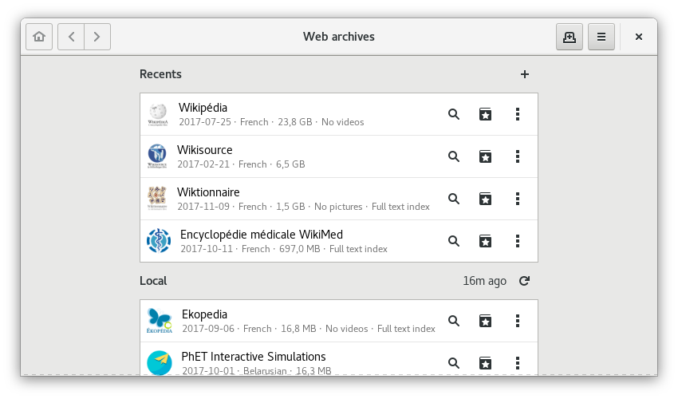

The [web][1] gives us easy access to knowledge. However, this progress is
accompanied by **perverse effects**. As many **intermediaries** separate us
from knowledge, we sacrifice some of our **fundamental rights** in exchange
for comfort. It is therefore important to protect oneself against the
**risks** raised.

<!-- summary_links -->

[1]: https://en.wikipedia.org/wiki/World_Wide_Web

<!-- more -->

First of all, it is necessary to differentiate [information][2] from the
[information medium][3], each medium having its own qualities and disadvantages,
the two main ones being :

- **[Paper medium][4]** :
  - **Pro** : requires no tool to access its content
  - **Con** : large storage space
- **[Digital medium][5]** :
  - **Pro** : fits in a smaller volume than the paper version
  - **Con** : depends on a tool to view its content

The existence of a third medium reconciling the best of these two worlds seems
hardly conceivable, it is therefore necessary to make a choise according to
circumstances while keeping in mind that **the paper medium remains the
preferred choice for unrestricted access to knowledge**.

This article focuses solely on the issues raised by access to [free content][6],
such as that provided by [Wikipedia][7], through a [computer][8].

## Escaping the intrinsic weaknesses of the Internet

**Wikipedia**, like all other Internet [services][9], has at least **two
conceptual weaknesses** :

1. **Accessibility** : an Internet connection is required to access the
   content, and Wikipedia may be blocked by government order.

2. **Confidentiality** : the user has no formal guarantee on the anonymization
   of its use of the content both on the network and on the Wikipedia server.

To solve these two problems, the idea is to **remove intermediaries**, by
placing content and a reading system directly on the device.

## Kiwix and its web archive format

_Wikipedia page, contained in the Wikipedia archive, displayed in Kiwix_

After this awerness my first reflex was to find out if **a solution already
existed**. Bingo ! **[Kiwix][10]** and its **[ZIM][11]** web archive format
immediately met my requirements. Even if the reasons that led to their
development are of a completely different nature, they provide a technical
solution to the above-mentioned problem.

Also, it is a [free software][12] and an [open format][13], which guarantees
[confidentiality][14] and **durability** of the data used.

## Why WebArchives exists

Knowing this **why develop WebArchives ?**

When I was thinking about this problem, the desktop version **Kiwix was
dying**, one of its dependencies no longer being maintained.

Because I'am a daily user of the [GNOME][15] desktop environment, I came up with
the idea of implementing **ZIM** file format support within the application
dedicated to consulting digital documents : [GNOME Documents][16].

But very quickly this idea seemed limited to me :

1. **ZIM format** : being **not recognized natively** by most [GNU/Linux][17]
   distributions, listing the archives on the hard disk became complicated

2. **Internal server** : in order to display the content of an archive,
   including embedded videos, its implementation became **a necessity**

3. **Downloadable content** : since no mechanism for discovering new content
   was proposed, its creation was **difficult to include** within the
   application

Hence the birth of the WebArchives application.

## WebArchives development

Still to avoid reinventing the wheel, I decided very early on to use the
[software library][18] developed by the **Kiwix** team, allowing the use of
**ZIM** files.

Since [libzim][19] is developed in [C++][20], my choice of programming language
turned to this one. Unfortunately I was forced to juggle between libraries coded
in **C++** and others in [C][21].

The result giving a code that is difficult to read and therefore maintainable,
I made the decision to build a [binding][22] of this library thanks to the
[introspection][23] capacity of the [GObject][24] library of the GNOME
environment.

As **GNOME** uses [GTK+][25] graphics library, the choice of the [Vala][26]
programming language seemed relevant, because this one offers an
[object-oriented paradigm][27] and is a [compiled language][28].

Graphically a mix of design rules from both **GNOME** and [Android][29] have
guided me in designing the interface, which should be as simple as possible.

## The future of WebArchives

_Wikipedia page, contained in the Wikipedia archive, displayed in WebArchives_

Ideally **WebArchives should not exist**, as web archives are documents almost
like other documents, they should be supported natively by GNOME Documents.
This is the **very long-term vision** of this project, its death. No need to
create one application per file format.

In the meantime I plan to make internal improvements, invisible to the user,
in order to **make the experience more fluid**. It is basically a question of
making the code asynchronous by using [threads][30].

Graphically the application is far from my ideal. Wanting to make it usable on
both large and small screens, as well as compatible with touch controls, I'm
waiting to see the result of the **GNOME** and [Purism][31] partnership about
the [Librem 5][32] smartphone running on **GNU/Linux**.

Not wanting to bother with package systems to distribute the application, I
chose to publish it only through the [Flatpak][33] system and the [Flathub][34]
repository. In the future, its presence in [Debian][35] repositories is possible
since its dependencies are almost all present in its repositories.

Today, WebArchives is based on the **ZIM** file format, which is for my
opinion the best performing one. However, once the application has reached a
certain maturity, it is not excluded to support other file formats, such as
[WARC][36] paired with **CDX**.

Other **functionalities** are possible in the **long term**:

- **Table of contents of the page displayed**
- **Navigation between archives** : to be able to open an external link of an
  archive directly in the archive corresponding to the domain name
- **Manage a query from another application** : for example from GNOME Maps to
  Wikipedia, to redirect to the corresponding archive.
- and many others...

## Beyond WebArchives

During the development of WebArchives I noticed the **absence of a number of
software components** to make life easier for both users and developers. These
topics will be developed in future articles :

- The existence of a kind of **GNOME Market**, looking like [GNOME Software][37]
  but to manage the downloading and updating of content such as maps,
  encyclopedias, application manuals, courses, tutorials, dictionaries...
- Too much rigidity in interface design, it is necessary to make the
  **interfaces more "_organic_"**. As well as the absence of essential
  components within [GLib][38] or **GTK+**, such as [ORM][39] or
  **VirtualListBox**.
- Rethinking the way user data is managed : **a meta file system** oriented
  synchronization, backup and confidentiality
- Establish **more [crowdsourcing][40]** : know-how, construction, company,
  schoolcontent...

## Conclusion

_WebArchives homepage_

In the end, this application is especially useful to me when my Internet
connection is down. In addition, I have less apprehension to search for
information concerning sensitive subjects because I am certain that I am not
being spy, whereas on the Wikipedia website I censor myself for fear of being
monitored.

Some will say that this tool has **no interest** today, because Internet
access has never been so simple. They're not entirely wrong, but you have to
think of this tool as a **fire extinguisher**, you don't need it in your
everyday life, but you may one day need it. Nothing tells us that tomorrow's
world will be free, **better safe than sorry**.

**Another advantage**, with such tool is very easy to share knowledge.
**Copying a digital file will always be easier and faster than copying a paper
book**.

Not wanting to go into too much detail, this article doesn't talk about all
that I learned by making this app, focusing essentially on why it exists. The
main purpose of this text is therefore to summarize the main stages of this
project.

## Useful links

- [WebArchives project presentation sheet][41]
- [WebArchives sources][42]
- [Link to Flathub applications including WebArchives][43]
- [Kiwix website][44]
- [Debian Website][45]
- [Flatpak website][46]
- [Flathub website][47]
- [GNOME website][48]
- [GObject introspection][49]

<!-- links -->

[2]: https://en.wikipedia.org/wiki/Information
[3]: https://en.wikipedia.org/wiki/Data_storage
[4]: https://en.wikipedia.org/wiki/Book
[5]: https://en.wikipedia.org/wiki/E-book
[6]: https://en.wikipedia.org/wiki/Free_content
[7]: https://en.wikipedia.org/wiki/Wikipedia
[8]: https://en.wikipedia.org/wiki/Computer
[9]: https://en.wikipedia.org/wiki/Server_(computing)
[10]: https://en.wikipedia.org/wiki/Kiwix
[11]: https://en.wikipedia.org/wiki/ZIM_(file_format)
[12]: https://en.wikipedia.org/wiki/Free_software
[13]: https://en.wikipedia.org/wiki/Open_format
[14]: https://en.wikipedia.org/wiki/Confidentiality
[15]: https://en.wikipedia.org/wiki/GNOME
[16]: https://wiki.gnome.org/Apps/Documents
[17]: https://en.wikipedia.org/wiki/Linux
[18]: https://en.wikipedia.org/wiki/Library_(computing)
[19]: https://github.com/openzim/libzim
[20]: https://en.wikipedia.org/wiki/C%2B%2B
[21]: https://en.wikipedia.org/wiki/C_(programming_language)
[22]: https://en.wikipedia.org/wiki/Language_binding
[23]: https://en.wikipedia.org/wiki/Reflection_(computer_programming)
[24]: https://en.wikipedia.org/wiki/GObject
[25]: https://en.wikipedia.org/wiki/GTK%2B
[26]: https://en.wikipedia.org/wiki/Vala_(programming_language)
[27]: https://en.wikipedia.org/wiki/Object-oriented_programming
[28]: https://en.wikipedia.org/wiki/Binary_file
[29]: https://en.wikipedia.org/wiki/Android_(operating_system)
[30]: https://en.wikipedia.org/wiki/Thread_(computing)
[31]: https://puri.sm/
[32]: https://puri.sm/shop/librem-5/
[33]: https://en.wikipedia.org/wiki/Flatpak
[34]: https://flathub.org/
[35]: https://en.wikipedia.org/wiki/Debian
[36]: https://en.wikipedia.org/wiki/Web_ARChive
[37]: https://en.wikipedia.org/wiki/GNOME_Software
[38]: https://en.wikipedia.org/wiki/GLib
[39]: https://en.wikipedia.org/wiki/Object-relational_mapping
[40]: https://en.wikipedia.org/wiki/Crowdsourcing
[41]: ../projects/web-archives
[42]: https://github.com/birros/web-archives
[43]: https://flathub.org/apps.html
[44]: https://www.kiwix.org/
[45]: https://www.debian.org/
[46]: https://www.flatpak.org/
[47]: https://flathub.org/
[48]: https://www.gnome.org/
[49]: https://wiki.gnome.org/Projects/GObjectIntrospection
