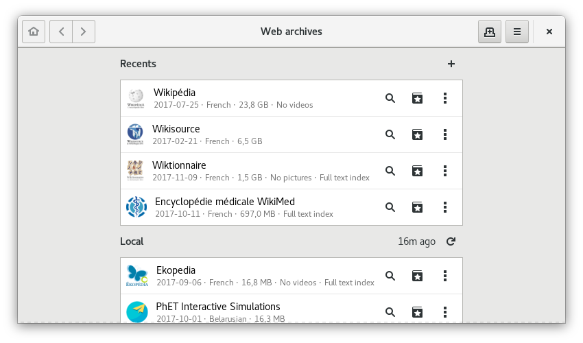

A __web archives reader__ offering the ability to browse __offline__ millions of
articles from large community projects such as [Wikipedia], [Wiktionary] or
[Wikisource].

<!-- Summary links -->

[Wikipedia]: https://en.wikipedia.org/wiki/Wikipedia
[Wiktionary]: https://en.wikipedia.org/wiki/Wiktionary
[Wikisource]: https://en.wikipedia.org/wiki/Wikisource

<!-- more -->

## Screenshots

*Application home page*

*Wikipedia page contained in the Wikipedia archive*

## Features

- List recently opened web archives
- List available local web archives
- List of web archives available to download
- Print a page
- Night mode (Basic support)
- Zoom controls
- Search in page
- History
- Bookmarks
- Search a page
- Keyboard shortcuts
- Multi-windows
- Multi-tabs
- Random page
- Sandboxed pages (Pages are isolated from the web)
- Ask for confirmation when opening an external link

## Installation

WebArchives was developed and tested under [GNU/Linux], with [GNOME] in sight.
However, it can be used under other desktop environments.

No method is provided to install this application on other platforms, such as
__Windows__ or __macOS__. This is a desktop application so it's not compatible
with mobile platforms such as __Android__ or __iOS__.

### WebArchives in Flatpak format

[Flatpak] installation is required : [Getting Flatpak].

Then add the [Flathub] repository and install WebArchives from a [terminal] :

    flatpak remote-add flathub https://flathub.org/repo/flathub.flatpakrepo
    flatpak install flathub com.github.birros.WebArchives

If this is your first Flatpak, restarting your session is necessary to make the
application appear in your launcher. It can also be executed from a terminal :

    flatpak run com.github.birros.WebArchives

Some __problems__ may occur when running the application, especially if your
desktop environment does not use [GTK+], such as __[Kde]__.

The installation of __two additional services__ is then required on the system
side to solve these problems, requiring the execution of one of these commands
depending on your distribution :

__Debian & Ubuntu__ :

    apt install tracker gvfs-backends

__Fedora__ :

    dnf install tracker gvfs

### Other installation methods

The implementation of a common installation method for existing distributions
is in preparation, with __Debian__ and __Ubuntu__ as priorities.

## Alternatives

This application is directly inspired by the [Kiwix] application. In this way
WebArchives as well as Kiwix can read the Web archives in [ZIM format]. Kiwix is
available for __Windows__, __GNU/Linux__, __iOS__ and __Android__.

## Useful links

- [Source code of WebArchives]
- [Flatpakref of WebArchives (external application)]
- [Kiwix website]
- [List of applications hosted on Flathub]

<!-- Liens externes et références -->

[GNU/Linux]: https://en.wikipedia.org/wiki/Linux
[GNOME]: https://en.wikipedia.org/wiki/GNOME
[Flatpak]: https://en.wikipedia.org/wiki/Flatpak
[Getting Flatpak]: https://flatpak.org/getting.html
[Flathub]: https://flathub.org/
[terminal]: https://en.wikipedia.org/wiki/Terminal_emulator
[GTK+]: https://en.wikipedia.org/wiki/GTK+
[KDE]: https://en.wikipedia.org/wiki/KDE
[Kiwix]: https://en.wikipedia.org/wiki/Kiwix
[ZIM format]: https://en.wikipedia.org/wiki/ZIM_(file_format)
[Source code of WebArchives]: https://github.com/birros/web-archives
[Flatpakref of WebArchives (external application)]: https://flathub.org/repo/appstream/com.github.birros.WebArchives.flatpakref
[Kiwix website]: https://www.kiwix.org/
[List of applications hosted on Flathub]: https://flathub.org/apps.html
