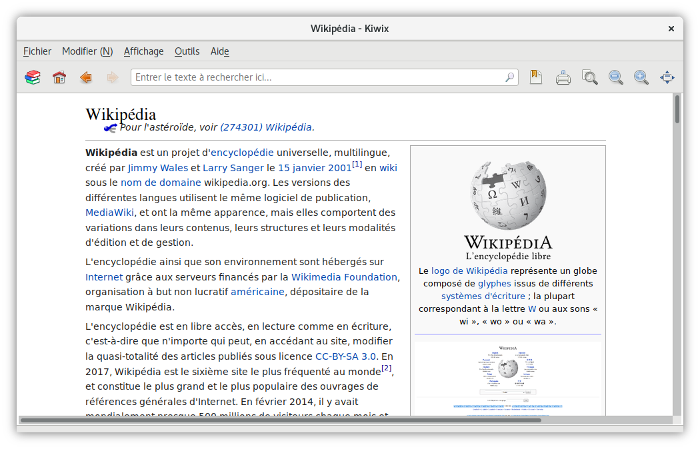

Le [web] nous offre un accès facilité à la connaissance. Cependant cette
évolution s'accompagne d'__effets pervers__. De nombreux __intermédiaires__
venant se loger entre nous et la connaissance, nous sacrifions certains de
nos __droits fondamentaux__ au profit du confort. Ainsi il est important de
se protéger face aux __risques__ soulevés.

<!-- Liens du résumé -->

[web]: https://fr.wikipedia.org/wiki/World_Wide_Web

<!-- more -->

Tout d'abord il convient de différencier l'[information] du [support de
l'information], chaque support ayant des qualités et des inconvénients, les
deux principaux étant :

- __[Support papier]__ :
  - __Pour__ : ne nécessite aucun outil pour accéder à son contenu
  - __Contre__ : espace de stockage conséquent
- __[Support numérique]__ :
  - __Pour__ : tient dans un plus petit volume que la version papier
  - __Contre__ : dépend d'un outil pour en consulter le contenu

L'existence d'un troisième support conciliant le meilleur de ces deux mondes
semble difficilement envisageable, il convient donc d'accorder son usage en
fonction des circonstances tout en gardant à l'esprit que __le support papier
reste le choix privilégié pour un accès sans contraintes à la connaissance__.

Cet article s'attarde uniquement sur les questions que soulève l'accès à du
[contenu libre], tel que celui fournit par [Wikipédia], au moyen d'un
[ordinateur].

## S'émanciper des faiblesses intrinsèques d'Internet

__Wikipédia__, comme tous les [services] sur Internet, dispose d'au moins
__deux faiblesses conceptuelles__ :

1. __Accessibilité__ : une connexion Internet est requise pour accéder au
contenu, qui plus est Wikipédia peut très bien être bloqué sur ordre d'un
gouvernement
2. __Confidentialité__ : l'utilisateur n'a aucune garantie formelle sur
l'anonymisation de l'usage qu'il fait du contenu aussi bien sur le réseau que
sur le serveur de Wikipédia

Pour résoudre ces deux problèmes l'idée consiste à __supprimer les
intermédiaires__, en disposant directement sur son périphérique du contenu et
d'un moyen de lecture.

## Kiwix et son format d'archive web

*Page Wikipédia, contenue dans l’archive Wikipédia, affichée dans Kiwix*

Suite à cette prise de conscience mon premier réflexe fut de rechercher si
__une solution existait déjà__. Bingo ! __[Kiwix]__ et son format d'archive
web __[ZIM]__ ont tout de suite répondu à mes exigences. Même si les raisons
qui ont mené à leur développement sont d'une tout autre nature, ces derniers
apportent une solution technique au problème cité précédemment.

Qui plus est il s'agit d'un [logiciel libre] et d'un [format ouvert], ce qui
garanti [confidentialité] et __pérennité__ des données consultées.

## Les raisons d'exister de WebArchives

Sachant cela __pourquoi développer WebArchives ?__

Au moment où je me suis intéressé à cette question la version bureau de
l'application __Kiwix périssait__, une de ses dépendances n'étant plus
maintenue.

Étant un utilisateur quotidien de l'environnement de bureau [GNOME], me vint à
l'esprit d'implémenter le support du format de fichier __ZIM__ au sein de
l'application dédiée à la consultation de documents numérique : [GNOME
Documents (en)].

Mais très vite cette idée me parut limitée :

1. __Format ZIM__ : étant __non reconnu nativement__ par la plupart des
distributions [GNU/Linux], lister les archives présentent sur le disque dur
devenait compliqué
2. __Serveur interne__ : afin d'afficher le contenu d'une archive, notamment
les vidéos embarquées, son implémentation devint __une nécessité__
3. __Contenu téléchargeable__ : aucun mécanisme de découverte de nouveau
contenu étant proposé, sa réalisation devenait __difficilement intégrale__ au
sein de l'application

D'où la naissance de l'application WebArchives.

## Le développement de WebArchives

Toujours pour éviter de réinventer la roue, j'ai très tôt décidé de me servir
de la [bibliothèque logicielle] développée par l'équipe de __Kiwix__,
permettant l'utilisation des fichiers __ZIM__.

Étant donné que [libzim (en)] est développée en [C++], mon choix de langage de
programmation se tourna vers celui-là même. Malheureusement je me suis
retrouvé à devoir jongler entre des bibliothèques codées en __C++__ et
d'autres en [C].

Le résultat donnant un code difficilement lisible et donc maintenable, j'ai
pris la décision de réaliser un [binding] de cette bibliothèque grâce à la
capacité d'[introspection] de la bibliothèque [GObject] de l'environnement
GNOME.

Vu que __GNOME__ a pour bibliothèque graphique [GTK+], le choix du langage de
programmation [Vala] sembla pertinent, ce dernier offrant un [paradigme
orienté objet] et étant un [langage compilé].

Graphiquement un mélange de règles de conception issues aussi bien de
__GNOME__ que d'[Android] m'ont guidé dans la conception de l'interface,
celle-ci devant être la plus simple possible.

## L'avenir de WebArchives

*Page Wikipédia, contenue dans l’archive Wikipédia, affichée dans WebArchives*

Idéalement __WebArchives ne devrait pas exister__, les archives web étant des
documents presque comme les autres celles-ci devraient être prises en charge
nativement par GNOME Documents. C'est la __vision à très long terme__ de ce
projet, sa disparition. Inutile de créer une application par format de fichier.

En attendant je compte effectuer des améliorations internes, invisibles de
l'utilisateur, afin de __rendre l'expérience plus fluide__. Il s'agit dans les
grandes lignes de rendre le code asynchrone notamment en utilisant des
[threads].

Graphiquement l'application est loin de mon idéal. Voulant la rendre
utilisable aussi bien sur des écrans larges comme plus petits, ainsi que
compatible avec des contrôles tactiles, j'attends de voir le résultat du
partenariat entre __GNOME__ et [Purism (en)] à propos du smartphone [Librem 5
(en)] tournant sous __GNU/Linux__.

Ne voulant pas m'embêter avec les systèmes de paquet pour distribuer
l'application j'ai donc choisi de la publier uniquement au travers du système
[Flatpak] et du dépôt [Flathub (en)]. À l'avenir sa présence dans les dépôts
de [Debian] est envisageable vu que ses dépendances sont quasiment toutes
présentent dans ses dépôts.

Aujourd'hui WebArchives s'articule uniquement autour du format de fichier
__ZIM__, celui-ci étant à mon goût le plus performant. Néanmoins il n'est pas
exclu, lorsque l'application aura atteint une certaine maturité, de prendre en
charge d'autres formats de fichier, tel que le format [WARC (en)] accompagné
de __CDX__.

D'autres __fonctionnalités__ sont envisageables sur le __long terme__ :

- __Table des matières de la page affichée__
- __La navigation entre archives__ : pouvoir ouvrir un lien externe d'une
archive directement dans l'archive correspondant au nom de domaine
- __Gérer une requête depuis une autre application__ : par exemple depuis
GNOME Maps vers Wikipédia, pour rediriger sur l'archive correspondante
- et bien d'autres...

## Au-delà de WebArchives

Durant le développement de WebArchives j'ai constaté l'__absence d'un certain
nombre de composants logiciels__ pour faciliter la vie à la fois des
utilisateurs ainsi que celle des développeurs. Ces sujets seront développés
dans de futurs articles :

- L'existence d'une sorte de __GNOME Market__, reprenant le fonctionnement de
[GNOME Software] mais pour gérer le téléchargement et la mise à jour de
contenu comme par exemple : cartes géographiques, encyclopédies, manuels
d'application, cours, tutoriels, dictionnaires...
- La trop grande rigidité dans la conception d'interfaces, il faut rendre les
__interfaces plus "*organiques*"__. Ainsi que l'absence de composants
essentiels au sein de la [GLib] ou de __GTK+__, comme des [ORM] ou encore une
__VirtualListBox__
- Repenser la manière de gérer les données utilisateurs :
__un méta système de fichiers__ orienté synchronisation, sauvegarde et
confidentialité
- Mettre en place __plus de [production participative]__ : savoir-faire,
construction, entreprise, contenu scolaire...

## Conclusion

*Page d'accueil de WebArchives*

Au final cette application m'est surtout utile lorsque ma connexion Internet
fait des siennes. De plus j'ai beaucoup moins d'appréhension à chercher des
informations concernant des sujets dits sensibles car j'ai la certitude de ne
pas être espionné, là où sur le site de Wikipédia mon usage est bridé de peur
d'être surveillé.

Certains diront qu'un tel outil n'a __aucun intérêt__ à l'heure où l'accès à
internet n'a jamais été aussi simple. Ils n'ont pas tout à fait tort,
cependant il faut voir cet outil comme __un extincteur__, vous en avez pas
besoin dans votre vie de tous les jours, mais il se peut qu'un jour il vous
soit indispensable. Rien ne nous dit que le monde de demain sera libre,
__mieux vaut prévenir que guérir__.

__Un autre avantage__ d'un tel outil réside dans la grande facilité pour
partager la connaissance. En effet __copier un fichier numérique sera toujours
plus facile et rapide que de copier un livre papier__.

Ne voulant pas trop entrer dans les détails, cet article survol tout ce que la
réalisation de ce projet m'a appris, s'attardant essentiellement sur sa raison
d'exister. Ce texte a donc pour principale utilité de récapituler les grandes
étapes de ce projet.

## Liens utiles

- [Fiche sur le projet WebArchives]
- [Sources de WebArchives (en)]
- [Lien vers les applications Flathub dont WebArchives (en)]
- [Site internet de Kiwix]
- [Site internet de Debian]
- [Site internet de Flatpak (en)]
- [Site internet de Flathub (en)]
- [Site internet de GNOME (en)]
- [GObject introspection (en)]

<!--Liens externes et références-->

[Support papier]: https://fr.wikipedia.org/wiki/Livre_(document)
[Support numérique]: https://fr.wikipedia.org/wiki/Livre_num%C3%A9rique
[information]: https://fr.wikipedia.org/wiki/Information
[support de l'information]: https://fr.wikipedia.org/wiki/Information#Support_de_l'information
[contenu libre]: https://fr.wikipedia.org/wiki/%C5%92uvre_libre
[Wikipédia]: https://fr.wikipedia.org/wiki/Wikip%C3%A9dia
[ordinateur]: https://fr.wikipedia.org/wiki/Ordinateur
[services]: https://fr.wikipedia.org/wiki/Serveur_informatique
[Kiwix]: https://fr.wikipedia.org/wiki/Kiwix
[ZIM]: https://fr.wikipedia.org/wiki/ZIM_(format_de_fichier_informatique)
[logiciel libre]: https://fr.wikipedia.org/wiki/Logiciel_libre
[format ouvert]: https://fr.wikipedia.org/wiki/Format_ouvert
[confidentialité]: https://fr.wikipedia.org/wiki/Confidentialit%C3%A9
[GNOME]: https://fr.wikipedia.org/wiki/GNOME
[GNOME Documents (en)]: https://wiki.gnome.org/Apps/Documents
[GNU/Linux]: https://fr.wikipedia.org/wiki/Linux
[bibliothèque logicielle]: https://fr.wikipedia.org/wiki/Biblioth%C3%A8que_logicielle
[libzim (en)]: https://github.com/openzim/libzim
[C++]: https://fr.wikipedia.org/wiki/C%2B%2B
[C]: https://fr.wikipedia.org/wiki/C_(langage)
[binding]: https://fr.wikipedia.org/wiki/Binding
[GObject]: https://fr.wikipedia.org/wiki/GObject
[Vala]: https://fr.wikipedia.org/wiki/Vala_(langage)
[paradigme orienté objet]: https://fr.wikipedia.org/wiki/Programmation_orient%C3%A9e_objet
[langage compilé]: https://fr.wikipedia.org/wiki/Fichier_binaire
[GTK+]: https://fr.wikipedia.org/wiki/GTK%2B
[Android]: https://fr.wikipedia.org/wiki/Android
[introspection]: https://fr.wikipedia.org/wiki/R%C3%A9flexion_(informatique)
[Purism (en)]: https://puri.sm/
[Librem 5 (en)]: https://puri.sm/shop/librem-5/
[Flatpak]: https://fr.wikipedia.org/wiki/Flatpak
[Flathub (en)]: https://flathub.org/
[Debian]: https://fr.wikipedia.org/wiki/Debian
[WARC (en)]: https://en.wikipedia.org/wiki/Web_ARChive
[GNOME Software]: https://fr.wikipedia.org/wiki/GNOME_Logiciels
[GLib]: https://fr.wikipedia.org/wiki/GLib
[ORM]: https://fr.wikipedia.org/wiki/Mapping_objet-relationnel
[threads]: https://fr.wikipedia.org/wiki/Thread_(informatique)
[production participative]: https://fr.wikipedia.org/wiki/Production_participative
[Fiche sur le projet WebArchives]: ../projects/web-archives
[Sources de WebArchives (en)]: https://github.com/birros/web-archives
[Lien vers les applications Flathub dont WebArchives (en)]: https://flathub.org/apps.html
[Site internet de Kiwix]: https://www.kiwix.org/fr/
[Site internet de Debian]: https://www.debian.org/index.fr.html
[Site internet de Flatpak (en)]: https://www.flatpak.org/
[Site internet de Flathub (en)]: https://flathub.org/
[Site internet de GNOME (en)]: https://www.gnome.org/
[GObject introspection (en)]: https://wiki.gnome.org/Projects/GObjectIntrospection
