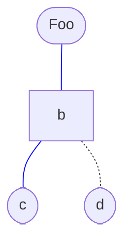

Petit billet pour mettre à jour mon usage des [graphes][1], [GitHub][2] venant
d'ajouter le support de [mermaid (en)][3] en tant que moteur de rendu en ligne
pour les graphes dans les fichiers [Markdown][4] :
[Include diagrams in your Markdown files with Mermaid (en)][5].

<!-- summary_links -->

[1]: https://fr.wikipedia.org/wiki/Th%C3%A9orie_des_graphes
[2]: https://fr.wikipedia.org/wiki/GitHub_(entreprise)
[3]: https://github.com/mermaid-js/mermaid
[4]: https://fr.wikipedia.org/wiki/Markdown
[5]: https://github.blog/2022-02-14-include-diagrams-markdown-files-mermaid/

<!-- more -->

De plus, une extension existe dans [Visual Studio Code][6] prenant en charge le
rendu des graphes mermaid dans l'aperçu des fichiers markdown :
[Markdown Preview Mermaid Support (en)][7]

Exemple de code :

```
%% Ajouter `mermaid` en tant que type MIME dans un fichier markdown

graph TD
  a([Foo])
  c([c])
  d([d])
  a --- b --- c
  b -.- d
  linkStyle 0 stroke:#00f
  linkStyle 1 stroke:#00f
```

Ce qui donne :



<!-- links -->

[6]: https://fr.wikipedia.org/wiki/Visual_Studio_Code
[7]: https://github.com/mjbvz/vscode-markdown-mermaid
